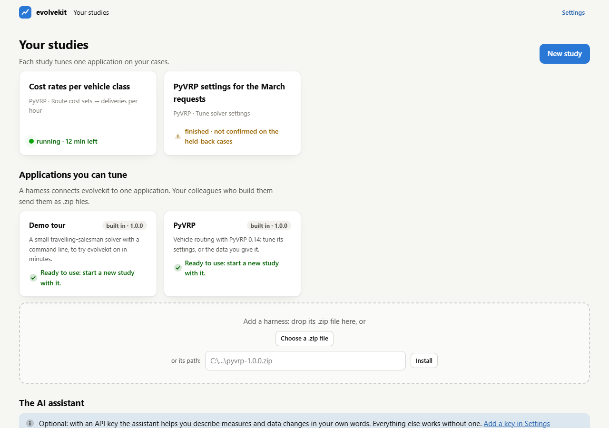
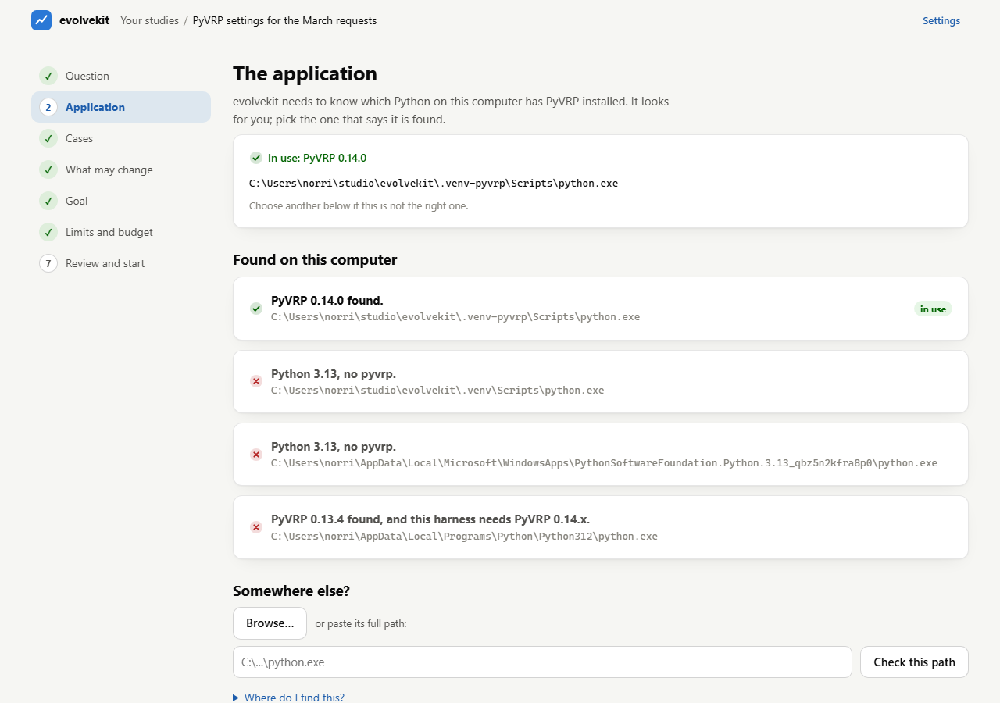
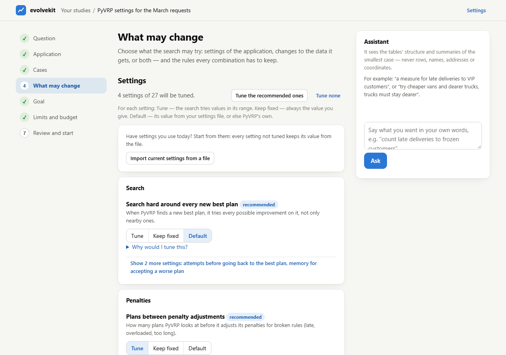
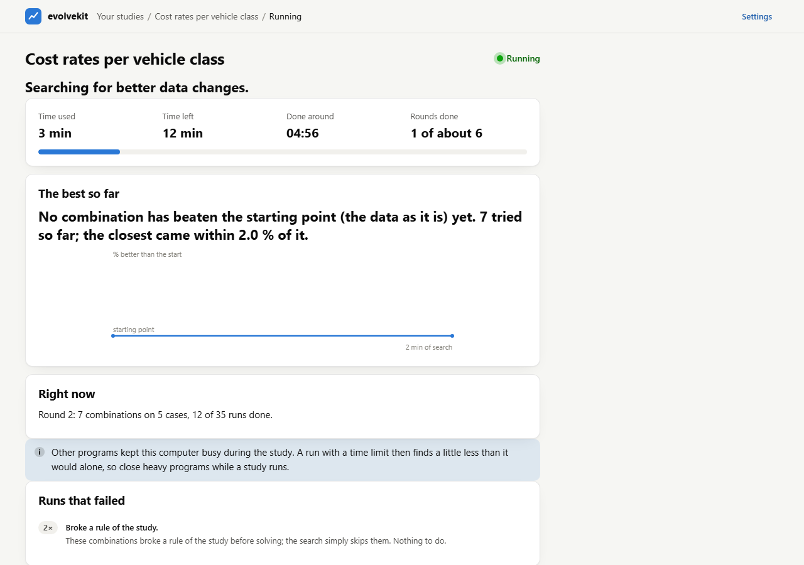
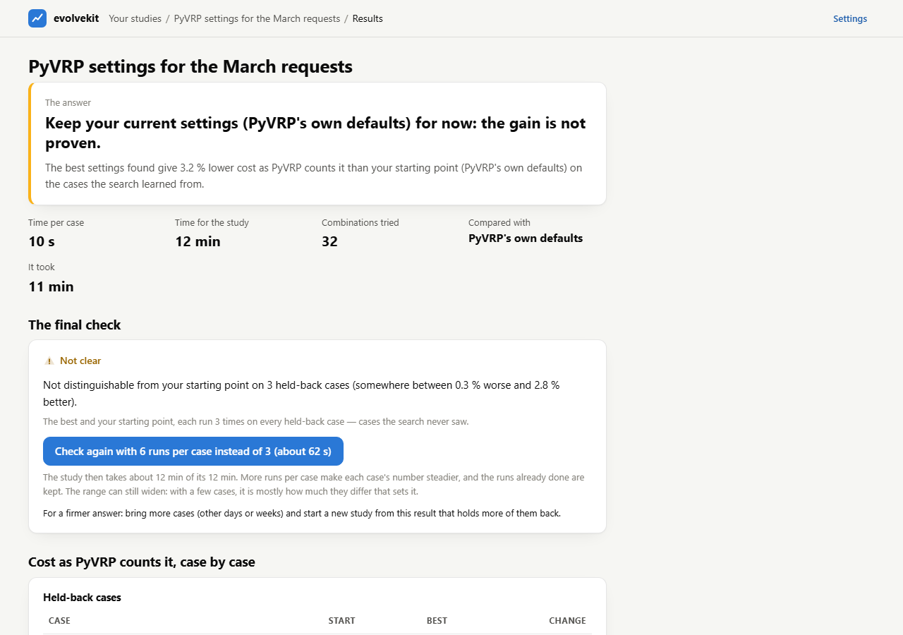

# The evolvekit app

The app is how someone who is not a programmer tunes an application with
evolvekit: pick the application, bring the cases, say what may change and
what counts as better, press Start, and read the answer — in the browser, on
your own computer. Under the hood every study is an ordinary evolvekit run
(see [Harnesses and studies](../README.md#harnesses-and-studies)); the app
asks the questions and explains the answers.



## Starting it

```
python -m evolvekit app
```

It opens your browser at `http://127.0.0.1:8780/`. Keep the window it runs in
open while you work; closing it stops the app, not the studies that are
running — they carry on, and the app shows them again when it is back.

| Option | Does |
|---|---|
| `--home DIR` | the library to use (default: `EVOLVEKIT_HOME`, else `~/evolvekit`) |
| `--port N` | the first port to try (default 8780) |
| `--no-browser` | print the address instead of opening a browser |
| `--shortcut` | Windows: put `evolvekit.cmd` on the desktop, which starts the app with a double-click |

The app answers only to this computer: it listens on 127.0.0.1, refuses
requests that name another host, and accepts changes only from its own page.

## Your library

Everything the app knows is in the library home, so it can be closed and
opened again at any time:

```
~/evolvekit/
  settings.yaml        the AI provider and models, the applications used before
  .env                 API keys: written by the app, never shown again
  harnesses/           harnesses you installed
  studies/<name>/      one folder per study: study.yaml, the pinned harness,
                       cases/, inputs/, preview/, runs/
```

A study folder is self-contained: copy it to another computer, point it at
the application there, and it runs.

## A study, step by step

**New study** asks three questions: which application (a *harness*
connects evolvekit to one — PyVRP and a demo come with evolvekit, colleagues
send others as `.zip` files), what you want to find out (a template, or blank),
and a name. Then seven steps, on a rail at the left; each is saved as you go,
and you can always go back.

1. **Question** — the application and the kind of study, and the name.
2. **Application** — where the application is on this computer. For PyVRP
   that is the Python that has it installed: the app looks in the usual
   places and asks each one, so the right one says *PyVRP 0.14.0 found*.
   Otherwise Browse, or paste the path.

   
3. **Cases** — the requests to work on: drop files or folders, choose a
   folder, type a folder's path, or use the harness's samples. Every file is
   read at once and described ("64 tasks, 19 vehicles in 9 types"), or you
   are told why it cannot be read. A few cases are **held back** as a test
   set: the search never sees them, and at the end the best result is checked
   on them. The app picks cases of different sizes; you can swap any. Leaving
   this step starts the **preview**: the smallest case solved once, at the
   starting values — proof that everything works, the real tables for the
   assistant, and the timing the plan needs.
4. **What may change** — the application's settings (each *Tune*, *Keep
   fixed at …* or *Default*, with *Why would I tune this?*; the recommended
   ones come first), changes to the data (a harness decides which: for PyVRP
   vehicle costs, fleet, shifts, time windows, prizes, service times), and
   rules every combination must keep ("trucks stay dearer per km than vans").
   A file of the settings you use today can be imported: everything not tuned
   keeps its value from there.

   
5. **Goal** — the measures to watch, each with its value on the preview case
   today; what should improve: *one measure*, *a combination* (weights shown
   as exchange rates: "1 late task counts as much as 2 hours of waiting"), or
   *in order of importance* (the first level decides unless two results are
   within its tolerance); and guardrails, which every case must meet
   ("no required task left out").
6. **Limits and budget** — the time per case (the application stops itself
   then; a run still going at 1.5 × that + 30 s counts as failed), retries,
   runs per case, the total time, and optional AI search help with a dollar
   cap. The **plan** says in words what the time buys ("about 9 rounds, about
   108 combinations, a final check on 3 held-back cases; done around 17:40"),
   and when it is too little, three concrete ways out. Experts can set the
   numbers under *Adjust*.
7. **Review and start** — everything in sentences, what is still missing,
   and the **test run**: the compiled study once on the smallest case, with
   every measure and the guardrails, before anything is spent. Then Start.

## While it runs



The running page says where the study is: time used and left, the rounds
done, the best improvement so far in plain words (with a chart), what runs
right now, and failed runs grouped with what to do about them. **Stop** ends
it within seconds and keeps the best so far. *Detailed dashboard* opens
evolvekit's full dashboard for the run.

## The results



1. **The headline**: "The best settings found give 4.2 % lower PyVRP's
   objective than your starting point on the training cases."
2. **The final check** on the held-back cases: *Confirmed* with the likely
   range, or honestly *Not distinguishable from your starting point*. With
   one held-back case there is no range; hold back three or more for an answer
   to rely on.
3. **Every measure**, starting point against best, on the training and the
   held-back cases.
4. **What changed**, old value → new, with what each setting does.
5. **Downloads**: the settings file for the application (and the same as
   command-line flags), the data changes, the changed requests, and
   `report.html` — one page to send to a colleague.
6. **Next steps**: a new study that starts where this one ended.

## The assistant

In steps 4 and 5 a panel takes requests in your own words — "count late
deliveries to frozen customers", "try cheaper vans and dearer trucks; trucks
must stay dearer" — and answers with proposals as cards: a measure (with its
SQL, the rows it counts, and its value on the preview case), a data change
("applies to 7 vehicle types"), a rule ("holds today"), a goal, a guardrail.
Nothing is added until you press *Add*.

Every proposal is checked on the preview case first: a measure must return a
number, a data change must select rows, a rule must hold at the starting
values. What fails goes back to the model with the reason, at most twice;
after that the card says honestly that it could not be expressed.

**What it sees:** the names, types and units of the tables, the harness's
settings and measures, the study so far, and summaries of the preview case —
how many rows, the smallest, average and largest numbers, and the values of
columns the harness marks as categories (tags, vehicle classes). **Never** a
row, a name, an address or a coordinate.

**Keys and cost:** Settings takes an OpenRouter or Azure OpenAI key (kept in
the library's `.env`, never shown again), or uses Claude Code on this
computer. The default model costs a few cents an answer; the cost of every
answer and the total per study are shown. Without a key the assistant says so,
and templates, the forms and the SQL box still do everything it does.

## When something is wrong

| You see | Do |
|---|---|
| *Python 3.13, no pyvrp* for every Python found | install PyVRP into a Python (`pip install pyvrp`), or point the study at the one where it is |
| a case *cannot be read* | open it: it is not a request the harness knows, or it is damaged; remove it |
| *fewer than 3 rounds* | take one of the three ways out the plan offers |
| *the starting point breaks a guardrail* | the guardrail is stricter than today's plans: loosen it, or give the application more time per case |
| *It failed* | the message says why; after a restart of the computer, *Start it again* |

## For developers

The page uses nothing but a JSON API (`evolvekit/app/api.py`), so a server
can take the app's place later: `/api/home`, `/api/settings`,
`/api/harnesses`, `/api/studies/{name}` and its `application`, `cases`,
`import`, `samples`, `split`, `inputs`, `preview`, `kpis/try`, `choices`,
`assistant`, `cards`, `plan`, `test-run`, `start`, `stop`, `final-check`,
`status`, `results`, `download/{export}` and `next`; and each run's dashboard
at `/studies/{name}/runs/{run}/dashboard/`. A run is `python -m
evolvekit.app.job STUDY RUN`, started so that it outlives the app.
