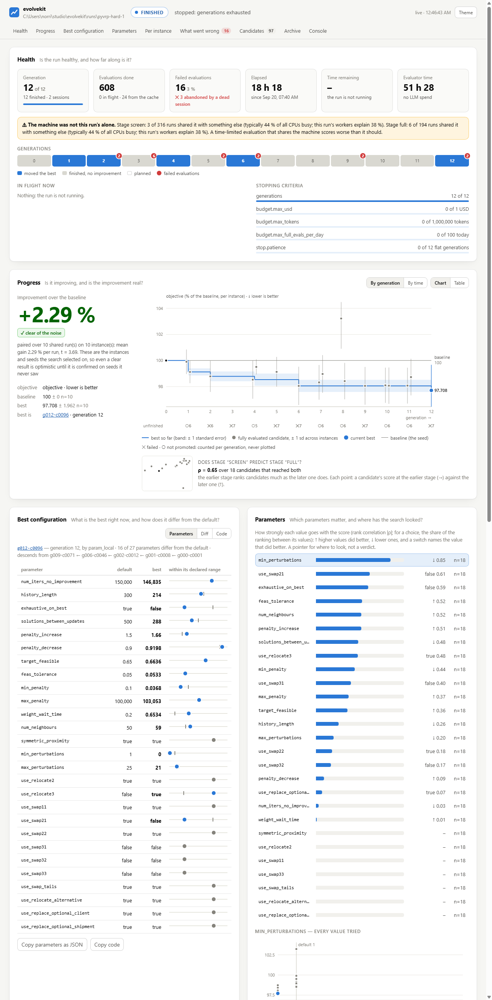
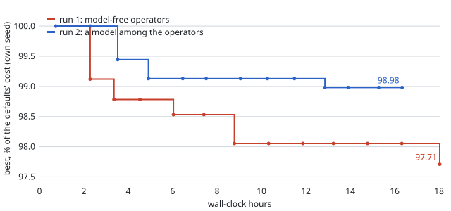
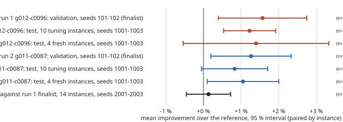

# Making evolvekit good at real, expensive tuning runs — report

> **Status of this document: DRAFT.** Sections 1–3 and 5–8 describe work that is
> done and verified as stated. Section 4 (the result) is **pending**: the tuning
> run was started on 2026-09-20 07:40 and takes about 18 hours, followed by the
> validation and the held-out test. No number in section 4 exists yet, and none
> is anticipated here.

The brief named three disappointments from a real tuning trial — not being able
to see what a run is doing, runs that break or lose work, and results that did
not hold up — and asked for them to be fixed and then *proven* on a public,
artificial PyVRP benchmark with a realistic budget (10 minutes per instance),
through the interface a user of a non-Python solver would have.

Everything is in pull requests against `master` (none merged), and merged into
`integration/expensive-tuning`. The friction log, the decision log and the
working notes are next to this file.

## 1. What was built

29 pull requests, #13–#41. Bug fixes started from a failing test; features are
stacked, and each PR names a compare link that shows its own diff.

### Observability

| PR | What |
|---|---|
| #19 | `events.jsonl` (append-only, every evaluator run as it starts and ends) and `heartbeat.json` |
| #20 | **one status document** (`build_status`), rendered by `status`, `status --json` and the dashboard — a human, a script and an agent cannot be told three different things |
| #21 | **the live dashboard**: `run --dashboard` / `evolvekit dashboard --run-dir …`; one self-contained HTML file, standard-library server, no build chain, works offline, `--export` for a ticket; running, stalled, crashed, resumed and finished runs; light and dark, 375–1440 px |
| #24 | typed parameters in the status and on the dashboard: log scales, a slot per category, importance of booleans and choices |
| #25 | per-instance comparison by name, the stage in progress (runs done of planned, time left), failures with instance / seed / attempt and whether a retry made up for them |
| #34 | **host load per evaluation** — was the machine busy with something else? (learnt the hard way, see 6.) |
| #36 | what watching the real run asked for: time left during the first generation, progress over wall-clock time, does the cheap stage predict the expensive one |

### Robustness

| PR | What |
|---|---|
| #15 | a stage timeout bounds the whole process tree (Job Object + parent links on Windows, a session on POSIX); full logs kept |
| #16 #17 #18 | budget and patience survive a resume; a run killed in generation 1 can be resumed; a resumed run does not replay its random stream |
| #25 | `retries` per run; a candidate that failed for good stops costing |
| #28 | **a run that dies mid-generation loses what was in flight**: evaluation cache + children written down before they are evaluated |
| #35 #37 #39 #40 | `run` exits 4 when it aborted; the daily cap stops the run instead of burning generations; a run directory belongs to one problem; a resumed run finishes its plan instead of starting another |
| #41 | **racing**: a candidate clearly behind the best after *k* instances stops costing |
| #32 | `preflight` repeats a failed command's last words |

### Result quality

| PR | What |
|---|---|
| #13 | a missing / NaN / infinite objective no longer scores 0 and ranks first |
| #14 | only fully evaluated candidates compete (closes issue #6) |
| #25 | `normalize: baseline` — every instance has the same say |
| #27 | model-free operators that use what the run has learnt (`param_local`, `param_cross`, `param_tpe`), measured against `param_lhs` in two regimes, including the one where they do not help |
| #20 #31 | the run's own improvement carries a noise verdict and says why it is optimistic; **`confirm`** makes the honest measurement: paired, interleaved, unseen seeds and instances, confidence interval, exact Wilcoxon test, exit code |

### The generic user

| PR | What |
|---|---|
| #22 | a run that calls no model needs none (no `models` section, no key) |
| #24 | `problem.parameters`: declare a typed space instead of writing a skeleton; `{params}` / `{params_json}`; validated before any solver time |
| #25 | `instances:` — one run per instance, `workers`, `pin_cpus` |
| #26 | the solver's own output: the last JSON line of stdout, flat objects with metadata, `kpi_patterns` for text |
| #29 | `{python}` — a bare `python` silently ran another interpreter, and another version of the solver |
| #31 | `export` (JSON, YAML, flags, code) |
| #33 | `init --template tune` writes a setup that runs; `examples/cli-solver/` walks the whole path |

### The benchmark

| PR | What |
|---|---|
| #23 | `benchmarks/pyvrp_hard/`: a seeded, bit-reproducible generator; 10 tuning instances (1000–3000 clients), 4 fresh ones, 2 smoke instances; every modelling feature of PyVRP 0.14.0 in every instance (verified from the installed package, and all instances verified feasible with the defaults); `solve.py`, a command-line front end with 27 tunables as flags; manifest with SHA-256 |
| #30 | the tuning setup (`tuning.yaml`, `tuning.smoke.yaml`) and the plan, committed before the run |

## 2. The dashboard

Screenshots are in `docs/img/dashboard/` and in the PRs (#21, #24, #25); all are
taken from path-scrubbed `--export` files of real runs.

It was verified in a real browser on a running run, a run killed with
`taskkill /F`, a resumed run (two sessions, an abandoned evaluation accounted
for) and finished runs; in light and dark; at 375, 500, 1100 and 1440 px; and it
went through three recorded design iterations before the PR and two rounds of
changes driven by real runs after it (#25, #36). Cost: `build_status` 12 ms; a
5.35 s run took 5.85 s with a page polling at 1 Hz.

What it answers, in the order of the brief: is the run healthy (state, generation,
evaluations done / in flight / failed, stage progress, elapsed, ETA, every
stopping criterion); is it improving (best against baseline, in percent, with
the noise and a verdict); what is the best configuration and how does it differ
from the defaults; which parameters matter and where has the search looked;
where does it win and lose, instance by instance; what went wrong, one click
from the command line, the instance, the seed and the logs.

Screenshots of the two real runs, taken headless from the live dashboard
once the machine was free (`docs/mission/img/`): run 1 in
[light](img/run1-light.png), [dark](img/run1-dark.png) and at
[phone width](img/run1-phone-light.png); run 2 in [light](img/run2-light.png),
[dark](img/run2-dark.png) and at [phone width](img/run2-phone-dark.png).

Two things the real runs' screenshots found, both after the dashboard had been
"verified": the word **"null"** rendered where the host-load warning would have
been on a run whose machine was its own (`replaceChildren(null)` — fixed on
#36's branch, failing test first, merged forward); and at phone width the
generation strip, the stopping-criteria values and the chart controls overflow
their card to the right (open, friction O-19). The lesson is in section 6.

## 3. The benchmark and the plan

`benchmarks/pyvrp_hard/README.md` documents the generator and which PyVRP
features are in every instance; `TUNING_PLAN.md` — written before the run —
documents the machine, the measured reason for three workers, what an
evaluation costs, how many fit, and what will count as evidence. In short:

* PyVRP is driven **only** through `solve.py`'s command line: flags in, one JSON
  object on stdout. No adapter was written; where evolvekit could not do that,
  evolvekit was changed.
* One full evaluation is 10 instances × 600 s = 100 CPU-minutes, ≈ 34 minutes on
  three pinned workers. Every generation screens 8 candidates on 4 instances for
  120 s and gives the full budget to the best 2: ≈ 90 minutes per generation,
  12 generations.
* Three workers because that is where per-run throughput is still flat on this
  machine (2 or 3 pinned processes: 106 % of a lone one each; 4: 77 % each).
* Evidence: seeds 101/102 choose the finalist; seeds 1001–1003 on the ten tuning
  instances **and** on four fresh instances test it against the defaults,
  interleaved, with a paired confidence interval and a Wilcoxon test.

## 4. Result

Two tuning runs and seven confirmations, 2026-09-20 07:40 to 2026-09-22
22:52, all on one laptop, every measurement started by a script rather than by
hand once the first run was going (D23). Every number below is read from a file
in the run directory (`confirm/<label>/comparison.json`, `runs.jsonl`,
`events.jsonl`), not from memory; `docs/mission/img/plots.py` draws the two
figures from the same files.

### 4.1 First run: model-free operators (`runs/pyvrp-hard-1`)

**The search.** 12 generations of 8 children, 18.3 h of wall clock (51.5 h of
solver time on three pinned workers), 608 evaluations, $0. Best configuration
by generation, in percent of the defaults' cost on the search's own seed (lower
is better): 100 → 99.12 (gen 1) → 98.78 (gen 2) → 98.53 (gen 4) → 98.05
(gen 6) → flat for five generations → **97.71 (gen 12, `g012-c0096`)**. The
search's own claim is therefore **+2.29 %** — optimistic by construction, as
the status line says next to the number.

* The 120 s screen on four instances predicted the 600 s stage on ten with a
  Spearman correlation of **0.65** over the 18 configurations that finished both
  (the defaults and 17 candidates):
  good enough to choose 2 of 8, not good enough to skip the full stage.
* Two candidates per generation were promoted to the full stage, 24 in all; **17**
  finished it. The others lost an instance to the 900 s stage timeout (8 runs,
  16 failed evaluations with their retries, on t02, t03 and t08) and were never
  ranked — see "t02" below. That is more than a quarter of the full-stage
  budget spent on candidates that could not compete.
* The run was killed once with my agent session and resumed from its cache
  (D22); generation 1's screening was disturbed by my own tests (D20). Neither
  touches the confirmations below, which are separate, interleaved measurements.

**Validation (seeds 101, 102 — choosing the finalist).**

| configuration | mean improvement | 95 % CI | instances | better / worse | Wilcoxon p | pairs |
|---|--:|--:|--:|--:|--:|--:|
| `g012-c0096` | +1.57 % | [+0.39, +2.74] | 9 | 8 / 1 | 0.0078 | 18 of 20 |
| `g006-c0046` | +1.44 % | [+0.41, +2.48] | 9 | 9 / 0 | 0.0039 | 18 of 20 |

Finalist by the rule fixed in advance (the higher mean): **`g012-c0096`**. The
two are not distinguishable from each other, and the rule did not need them to
be. Nine instances, not ten: see "t02".

**Test (seeds 1001–1003, never used before; finalist against the defaults, interleaved).**

| instances | mean improvement | 95 % CI | better / worse | Wilcoxon p | pairs | verdict |
|---|--:|--:|--:|--:|--:|---|
| the 10 tuning instances | **+1.23 %** | **[+0.54, +1.92]** | 9 / 1 | 0.0059 | 28 of 30 | better than the defaults |
| the 4 fresh instances | +1.40 % | [−0.54, +3.33] | 4 / 0 | 0.125 | 12 of 12 | **not distinguishable** |

| instance | clients | improvement | pairs won |
|---|--:|--:|--:|
| t01 | 1000 | −0.33 % | 1 of 3 |
| t02 | 1200 | +0.44 % | 1 of 1 |
| t03 | 1400 | +0.94 % | 3 of 3 |
| t04 | 1600 | +1.48 % | 3 of 3 |
| t05 | 1800 | +0.80 % | 1 of 3 |
| t06 | 2000 | +1.83 % | 3 of 3 |
| t07 | 2200 | +2.34 % | 3 of 3 |
| t08 | 2500 | +0.21 % | 2 of 3 |
| t09 | 2800 | +2.55 % | 3 of 3 |
| t10 | 3000 | +2.03 % | 3 of 3 |
| f01 (fresh) | 1100 | +0.06 % | 2 of 3 |
| f02 (fresh) | 1700 | +0.75 % | 2 of 3 |
| f03 (fresh) | 2300 | +2.03 % | 3 of 3 |
| f04 (fresh) | 2900 | +2.75 % | 3 of 3 |

**Reading it.**

* The improvement is **real and small**: +1.2 % on seeds the search never saw,
  with an interval that excludes zero. It is about half of what the search
  claimed (+2.29 % → +1.57 % on validation → +1.23 % on test). That shrinkage is
  the winner's curse the plan predicted, and the reason `confirm` exists.
* On the fresh instances the *estimate* is the same (+1.4 %, 4 of 4 better, the
  same growth with size) but four instances cannot carry an interval: p = 0.125
  is the smallest value a four-instance Wilcoxon test can produce. By the plan's
  own definition this is "not distinguishable", and that is how it is reported.
  The design lesson is mine: four fresh instances were too few to be able to
  say yes.
* The gain grows with instance size: below 1500 clients it is within noise
  (−0.3 to +0.9 %), from 2000 clients on it is +1.8 to +2.8 % on six of seven
  instances. With a fixed ten minutes, the larger instances are further from
  converged, and what the tuned configuration buys is speed: a cheaper
  neighbourhood (`swap21` off, `relocate3` on, `exhaustive_on_best` off), a
  shorter acceptance history (214 instead of 300) and faster penalty updates
  (every 288 registrations instead of 500).
* What this is **not**: evidence that the configuration is better on another
  machine, under another time limit, or on instances of another family.

**t02.** On `t02-n1200-clustered-banded`, `pyvrp.solve` with a 600 s limit did
not return within the 900 s stage timeout for some seeds — *for the defaults as
well as for tuned configurations* (defaults: seeds 1001, 1002; `g012-c0096`:
seeds 101, 102, 1001; seed 0 was fine for both). During the search the same
happened to seven candidates: five times on t02, twice on t03, once on t08,
each time again on the retry. It is therefore not something
tuning introduced, but it has two consequences. First, `confirm` drops a pair
when either side fails (friction Q-12), so t02 is missing from the validation
interval and enters the test with one pair of three; the intervals above are
over the pairs that finished, and a user who needs an answer on *every* instance
should read "28 of 30" as part of the result. Second, the cause is open: the
deadline in `solve.py` is checked between iterations, so a single iteration ran
for more than five minutes. Reproducing it needs the machine, which is busy
with the second run; it is the first item of section 8.

**The tuned configuration** (`g012-c0096`; defaults in brackets where changed):
`num_neighbours` 59 (50), `history_length` 214 (300), `exhaustive_on_best`
false (true), `solutions_between_updates` 288 (500), `penalty_increase` 1.66
(1.5), `penalty_decrease` 0.920 (0.9), `min_penalty` 0.037 (0.1),
`weight_wait_time` 0.65 (0.2), `min_perturbations` 0 (1), `max_perturbations`
21 (25), `use_relocate3` true (false), `use_swap21` false (true);
`num_iters_no_improvement`, `target_feasible`, `feas_tolerance` and
`max_penalty` moved by less than 7 %; everything else is at its default.

### 4.2 Second run: a model among the operators (`runs/pyvrp-hard-llm`)

Same instances, stages, time limits, workers and pinning; `rewrite` (Claude
Sonnet 5 via OpenRouter, Opus 5 for the two scheduled big steps) at 0.35 next
to `param_local` 0.35, `param_tpe` 0.2, `param_lhs` 0.1; racing on the full
stage (`after: 4, margin_pct: 1.5`). Started by the autopilot 30 minutes after
run 1's confirmations ended, on the same machine, otherwise idle.

**The search.** 12 generations, 16.3 h, 540 evaluations, **$0.53 over 29 model
calls** (97.6 k tokens) against a $5 cap. Best by generation: 100 → 99.44
(gen 2) → 99.13 (gen 3) → flat → **98.98 (gen 9, `g009-c0073`)** → flat. The
search's own claim is +1.02 % (t = 2.27) — against run 1's +2.29 %.

* The model wrote 25 children; every one passed the static stage, none was
  rejected as a duplicate. At the 120 s screen the model's children scored
  96.8–98.6, i.e. no better than the arithmetic operators' — and it never
  beat the run's best on its own. But **every ranked configuration of the run
  descends from two consecutive model rewrites in generations 2–3**
  (`g002-c0017` → `g003-c0018`, the 99.13 step); the local operator refined
  from there. That is what the model contributed: the first move, not the last.
* Racing fired 3 times in 97 candidates (one `rewrite`, two `param_tpe`),
  saving about three hours of solver time. Little, because most losers never
  got as far as the fourth instance.
* The 900 s timeout (below) hit this run harder: **13 of the 25 configurations
  that reached the full stage lost an instance to it** (run 1: 7), so only 9
  were ranked. Seven of the thirteen were `param_tpe` children.
* The screen predicted the full stage with ρ = 0.83 over the 9 that finished
  both — but 9 is too few to read much into.

**Validation, test, fresh (finalist `g011-c0087`, by the same rule).**

| comparison | mean improvement | 95 % CI | instances | better / worse | Wilcoxon p | pairs | verdict |
|---|--:|--:|--:|--:|--:|--:|---|
| validation `g011-c0087` (seeds 101, 102) | +1.26 % | [+0.20, +2.33] | 9 | 8 / 1 | 0.027 | 18 of 20 | better |
| validation `g009-c0073` (seeds 101, 102) | +0.93 % | [−0.53, +2.38] | 10 | 7 / 3 | 0.19 | 17 of 20 | not distinguishable |
| **test, 10 tuning instances (1001–1003)** | **+0.83 %** | **[−0.05, +1.71]** | 9 | 7 / 2 | 0.098 | 27 of 30 | **not distinguishable** |
| test, 4 fresh instances (1001–1003) | +1.05 % | [+0.10, +2.00] | 4 | 4 / 0 | 0.125 | 11 of 12 | better |

The finalist's test interval misses zero by 0.05 points; by the rule fixed in
advance it is *not distinguishable* from the defaults, where run 1's finalist
(+1.23 % [+0.54, +1.92]) was. The fresh-instance verdicts come out the other way
round (run 2 "better", run 1 not) — with four instances the verdict hangs on the
spread, not the mean, and the two runs' fresh estimates lie inside each other's
intervals. Neither fresh verdict should be read as more than "same size of
effect, same growth with instance size". t02 is absent from the test entirely:
the defaults timed out on two of its seeds and the finalist on the other two.

**The configuration** (`g011-c0087`; defaults in brackets): `num_neighbours`
36 (50), `history_length` 200 (300), `exhaustive_on_best` false (true),
`solutions_between_updates` 300 (500), `penalty_increase` 1.4 (1.5),
`penalty_decrease` 0.82 (0.9), `target_feasible` 0.72 (0.65),
`num_iters_no_improvement` 220 000 (150 000), `max_penalty` 150 000
(100 000), `feas_tolerance` 0.094 (0.05), `max_perturbations` 21 (25),
`use_relocate2` **false** (true), `use_swap11` **false** (true),
`use_relocate3` true (false). The round numbers are the model's; the two basic
operators switched off are its idea too (from `g003-c0018`), and the local
operator never switched them back on.

### 4.3 The two finalists against each other

One interleaved `confirm` (`--against`, PR #43): run 2's finalist against run
1's, seeds 2001–2003, all 14 instances, 84 runs.

| | mean | 95 % CI | instances | better / worse | Wilcoxon p | pairs |
|---|--:|--:|--:|--:|--:|--:|
| `g011-c0087` (run 2) against `g012-c0096` (run 1) | +0.13 % | [−0.45, +0.72] | 13 | 7 / 6 | 0.74 | 34 of 42 |

**Not distinguishable.** Per instance the differences are within ±1 % except
f01 (+2.2 %, over two pairs) — noise-sized, both ways. On the plan's own
criterion, *the model added nothing measurable*: the two searches found
configurations of the same quality, and run 1's holds up better on the test
(its interval excludes zero) and fails less often (run 2's finalist timed out
on 8 of its 42 runs here, run 1's on 1).

What the second run cost and bought, in one line: **$0.53 and the same 16
hours of solver time, for a configuration that is as good, not better, and less
robust.** The honest version of the LLM story on this problem is the one in
4.2: the model made the first useful move and the arithmetic did the rest —
and a model-free search made an equally useful first move on its own.

### 4.4 Reading it all

1. **Tuning PyVRP's defaults for ten minutes on this machine buys about 1 %,
   and it is real.** Run 1: +1.23 % [+0.54, +1.92] on the tuning instances on
   seeds it never saw; the same size on fresh instances, growing with instance
   size (+2 to +2.8 % above 2000 clients). Half of what the search claimed.
2. **The search's own number is not the result.** +2.29 % → +1.57 % → +1.23 %
   (run 1); +1.02 % → +1.26 % → +0.83 % (run 2). `confirm` was the right thing
   to build.
3. **Four fresh instances are too few** to say yes or no; the two runs' fresh
   verdicts flipped on the spread alone. Ten would have cost 7.5 more hours per
   run and would have settled it.
4. **A model in the loop neither helped nor hurt the quality**, cost half a
   dollar, and produced a less robust configuration. On a 27-parameter box with
   a mature solver's defaults as the seed, the arithmetic operators (#27) are
   the workhorse; the model's value, if any, is in the first move.
5. **The solver has a hang** on some instances (t02, t03, t08, f01, f02) for
   some seeds and configurations, including the defaults: `pyvrp.solve` does
   not return from a 600 s limit within 900 s, with empty stdout. It cost the
   two searches 7 and 13 of their 25 full-stage configurations and the
   confirmations 26 of their 372 runs. **One reproduction attempt alone on the
   idle machine (defaults, t02, seed 1001 — a pair that timed out twice in the
   test) finished in 602 s with 73 676 iterations**, so it is not a property of
   (configuration, seed) alone; whether it is a timing-dependent solver state
   or something in how three pinned processes share this laptop is open. Next
   step in section 8. Until it is understood, "28 of 30 pairs" is part of every
   result above.

## 5. Friction log

`FRICTION_LOG.md`: 63 items found by six docs-only "new user" personas and by
me before any fix was started, plus five found by the real runs afterwards
(Q-11 the near-duplicate gate against typed parameters, Q-12 `confirm` and
failed pairs, O-19 the phone-width overflow, O-20 the confirmation ETA, O-21
"null" — the last fixed). Final count: **41 fixed, 7 partly, 20 open**, each
with the PR that did it. All six items rated *blocker* (R-01, R-02, R-03, Q-01,
Q-02, Q-06) are among the fixed. The open ones are mostly documentation and
small CLI items, plus R-12 (nothing stops a run in which every child fails),
R-07 (ids re-used after a partial record) and Q-12, which the result section
had to work around by hand.

## 6. What went wrong along the way (mine)

* **I slowed my own measured run.** While generation 1 was screening, I ran test
  suites pinned to the one free core at low priority, believing that was safe.
  A configuration equal to the defaults to three decimal places then did 19–33 %
  fewer iterations than the baseline. On a laptop all cores share one power
  budget: pinning keeps work off the solver's cores, not from slowing them down.
  Eight screening scores are biased by about +2 to +5 %; no full-stage evaluation
  is. The run was kept and the incident recorded (decision D20); from then on
  nothing else ran on the machine, and CI became the test runner. It produced a
  feature (#34) and a paragraph in the README.
* A wide fan-out of sub-agents at the start exhausted the session budget twice
  and cost hours (decision D9); after that, at most one or two at a time.
* A defect in an open PR of mine was found three times by later work (#21 twice,
  #24 once); each was fixed on that PR's branch with its own failing test and
  merged forward (D19).

## 7. Decisions

`DECISION_LOG.md`, D1–D26. The ones that shape the result: no LLM backend was
available at the start, so the first search is model-free (D7); three pinned
workers, measured (D12); percent-of-baseline as the default aggregate (D15);
the solver wrapped with no adapter (D18); nothing else on the machine during a
run (D20); a second, LLM-mixed run under the same protocol once a key was
offered, via an API so that model calls put no load on the machine (D21); the
run resumed rather than restarted after it died with my session (D22);
everything after the first run driven by one detached script with the
finalist rule fixed in advance (D23); Sonnet 5 / Opus 5 with a $5 cap (D24);
the head-to-head as a feature, not a script (D25); and the t02 hang reported
as open rather than explained away (D26).

## 8. What to do next, in order

0. **The solver hang** (4.4, item 5): make `solve.py` dump its Python stack to
   stderr at 1.4× the time limit (`faulthandler.dump_traceback_later`), rerun
   the head-to-head's timed-out pairs under the stage with three workers, and
   read the stack. Until then every result carries "N of M pairs".
1. Review and merge the fix PRs #13–#18, #22, #29, #32, #35, #37, #38, #39: small, independent in spirit, each with its failing test.
2. The observability stack #19 → #20 → #21, then #24 → #25 → #26 (the generic-user path), then #27, #28, #31, #33, #34, #36.
3. Use racing (#41) in the next tuning run — it was written while this one was already going — and replace its fixed margin by a sequential test once there is data on how noisy paired differences are.
4. Re-evaluate the incumbent on a second seed when it changes (intensification), so the search itself is less exposed to a lucky seed — today only `confirm` protects against that.
5. R-12, R-07 and the documentation items in the friction log.
6. One page that states the whole evaluator contract (G-10).
7. Ten fresh instances, not four, next time (4.4, item 3) — 7.5 more hours per run.
8. `confirm` should count a failed candidate run as a loss, or at least carry the count into the verdict (Q-12); and its ETA is wrong by an order of magnitude on a running confirmation (O-20).
9. The near-duplicate gate should compare *values* when a parameter space is declared (Q-11); with it on, every model child was re-prompted once.
10. A second LLM experiment worth running: `configure()` is ordinary code, so a configuration that depends on the instance ("fewer neighbours above 2000 clients") is within a model's reach and out of a parameter sweep's — but only if the harness passes the instance to `configure()`, which it does not today. That, not "a model among the operators", is where a model could do what arithmetic cannot.
